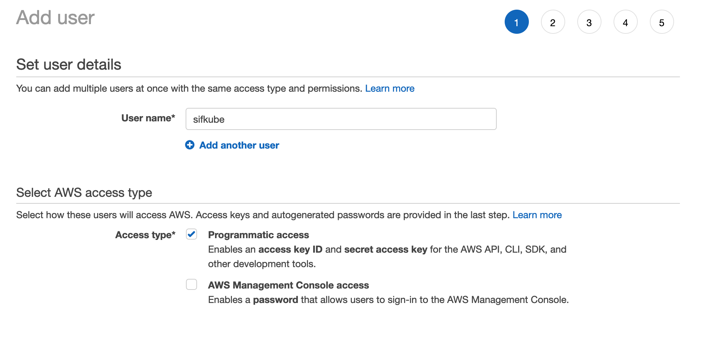

# Running Sifnode on Kubernetes

## Prerequisites <a id="9cbf"></a>

_This tutorial assumes that you have at least a basic understanding of setting up AWS and configuring your access keys accordingly, so that you may interact with AWS via the CLI Tool._

**What is Kubernetes? \(k8s\)**

[Kubernetes](https://kubernetes.io/) is a portable, extensible, open-source platform for managing containerized workloads and services, that facilitates both declarative configuration and automation. It has a large, rapidly growing ecosystem. Kubernetes services, support, and tools are widely available.

We are going to be using the Amazon Elastic Kubernetes Service \(Amazon EKS\) for this tutorial. make sure you have admin access to a AWS account before starting this tutorial. 

Here's the rough breakdown of the overall cost of running a node 

_~ $73 per month for the EKS Control Plane_

_~ $137 per month for a t2.xlarge instance_

_~$70 in load balancer costs_

_~$100 in disk costs_  


**Install Dependencies:**

* [Ruby 2.7.x](https://www.ruby-lang.org/en/documentation/installation)
* [Golang](https://golang.org/doc/install)
* [JQ JSON Processor](https://stedolan.github.io/jq/)
* [AWS CLI Tool](https://aws.amazon.com/cli/)
* [kubectl](https://docs.aws.amazon.com/eks/latest/userguide/install-kubectl.html)
* [Terraform](https://learn.hashicorp.com/tutorials/terraform/install-cli)
* [Helm](https://helm.sh/docs/intro/install/)

**Configure AWS CLI Tool:**

After installing the [AWS CLI tool](https://docs.aws.amazon.com/cli/latest/userguide/cli-chap-welcome.html) locally on your machine, next you need to add some AWS account credentials to complete the installation.

Head over to the AWS IAM console and create a new User with the following permission settings




Proceed to review and create the user. In the next screen you will be showing some credentials \(Access Key and secret\) Keeps these handy as we'll be using them in the next step.

```text
aws configure
AWS Access Key ID [None]: <ENTER YOUR ACCESS KEY>
AWS Secret Access Key [None]: <ENTER YOUR ACCESS SECRET KEY>
Default region name [None]: us-west-2
Default output format [None]: json
```


#### Configure kubectl tool

Amazon EKS uses IAM to provide authentication to your Kubernetes cluster through the [AWS IAM authenticator for Kubernetes](https://github.com/kubernetes-sigs/aws-iam-authenticator). You can configure the stock `kubectl` client to work with Amazon EKS by installing the AWS IAM authenticator for Kubernetes and modifying your `kubectl` configuration file to use it for authentication.

Complete kubectl installation by installing aws-iam-authentication tool

[https://docs.aws.amazon.com/eks/latest/userguide/install-aws-iam-authenticator.html](https://docs.aws.amazon.com/eks/latest/userguide/install-aws-iam-authenticator.html)

### Scaffold and deploy a new cluster

1. Clone the sifnode [repository](https://github.com/Sifchain/sifnode) and switch to the root of the sifchain project.
2. Checkout the latest testnet release

```
git clone https://github.com/Sifchain/sifnode.git
```

```text
cd sifnode
git checkout tags/merry-go-round-1
```


Scaffold a new cluster:

```text
rake "cluster:scaffold[<chainID>,<provider>]"
```

e.g.:

```text
rake "cluster:scaffold[merry-go-round,aws]"
```

where:

| Param | Description |
| :--- | :--- |
| `<chainID>` | The Chain ID of the network \(e.g.: merry-go-round\). |
| `<provider>` | The cloud provider to use \(currently only AWS is supported\). |

1. Once complete, you'll notice that several Terraform files/folders have been setup inside of the `.live` directory. We recommend you leave the defaults as-is, but for those that have experience with Terraform, feel free to adjust the configuration as you see fit.
2. Deploy the cluster to AWS:

```text
rake "cluster:deploy[<chainID>,<provider>]"
```

e.g.:

```text
rake "cluster:deploy[merry-go-round,aws]"
```

Once complete, you should see your cluster on your AWS account. You can also check using `kubectl`:

```text
kubectl get pods --all-namespaces --kubeconfig ./.live/sifchain-aws-merry-go-round/kubeconfig_sifchain-aws-merry-go-round
```

### Deploy a new node

Generate a new mnemonic key for your node. This key is what your node will use to eventually sign transactions/blocks on the network.

```text
rake "keys:generate:mnemonic"
```

Import your newly generated key:

```text
rake "keys:import[<moniker>]"
```

where:

| Param | Description |
| :--- | :--- |
|  | The moniker or name of your node as you want it to appear on the network. |

e.g.:

```text
rake "keys:import[my-node]"
```

Check that it's been imported accordingly:

```text
sifnodecli keys show <moniker> --keyring-backend file 
```

Deploy a new node to your cluster and connect to an existing network:

```text
rake "cluster:sifnode:deploy:peer[<chainID>,<provider>,<namespace>,<image>,<image tag>,<moniker>,<mnemonic>,<peer address>,<genesis URL>]"
```

where:

| Param | Description |
| :--- | :--- |
| `<chainID>` | The Chain ID of the network \(e.g.: merry-go-round\). |
| `<provider>` | The cloud provider to use \(currently only AWS is supported\). |
| `<namespace>` | The Kubernetes namespace to use \(e.g.: sifnode\). |
| `<image>` | The image to pull down from Docker Hub \(e.g.: sifchain/sifnoded\). |
| `<image tag>` | The image tag to use \(e.g.: merry-go-round\). |
| `<moniker>` | The moniker or name of your node as you want it to appear on the network. |
| `<peer address>` | The address of the peer to connect to. |
| `<genesis URL>` | The URL of genesis file for the network. |

e.g.:

```text
rake "cluster:sifnode:deploy:peer[merry-go-round,aws,sifnode,sifchain/sifnoded,merry-go-round-1,my-node,'my mnemonic',ff0dd55dffa0e67fe21e2c85c80b0c2894bf2586@52.89.19.109:26656,http://52.89.19.109:26657/genesis]"
```

In the above command replace `my-node` with your moniker and `my mnomonic` with your mnemonic. 

Once deployed, check the status of the pods:

```text
kubectl get pods -n sifnode --kubeconfig ./.live/sifchain-aws-merry-go-round/kubeconfig_sifchain-aws-merry-go-round
```

and you should see something that resembles the following:

```text
NAME                           READY   STATUS     RESTARTS   AGE
sifnode-75464fcd4c-dsmzq       0/1     Init:0/1   0          10s
sifnode-cli-67bcfd4b54-mhdjx   0/1     Running    0          10s
```

_It may take several minutes for your node to become active._

Once your node is active \(Status of "Running"\), you can view it's sync status by looking at the logs. Run:

```text
kubectl -n sifnode logs <pod> --kubeconfig ./.live/sifchain-aws-merry-go-round/kubeconfig_sifchain-aws-merry-go-round
```

e.g.:

```text
kubectl -n sifnode logs sifnode-65fbd7798f-6wqhb --kubeconfig ./.live/sifchain-aws-merry-go-round/kubeconfig_sifchain-aws-merry-go-round
```

### Stake to become a validator

In order to become a validator, that is a node which can participate in consensus on the network, you'll need to stake `rowan`.

1. If using testnet, obtain funds from the faucet.
2. Get the public key of your node:

```text
rake "validator:expose:pub_key[<chainID>,<provider>,<namespace>]"
```

e.g.:

```text
rake "validator:expose:pub_key[merry-go-round,aws,sifnode]"
```

1. Stake:

```text
rake "validator:stake[<chainID>,<moniker>,<amount>,<public key>,<node RPC address>]"
```

where:

| Param | Description |
| :--- | :--- |
| `<chainID>` | The Chain ID of the network \(e.g.: merry-go-round\). |
| `<moniker>` | The moniker or name of your node as you want it to appear on the network. |
| `<amount>` | The amount to stake, including the denomination \(e.g.: 100000000rowan\). |
| `<public key>` | The public key of your validator \(you got this in the previous step\). |
| `<node RPC address>` | The address to broadcast the transaction to \(e.g.: tcp://:26657\). |

e.g.:

```text
rake "validator:stake[merry-go-round,my-node,10000000rowan,<public key>,tcp://52.89.19.109:26657]"
```

1. It may take several blocks before your node appears as a validator on the network, but you can always check by running:

```text
sifnodecli q tendermint-validator-set --node <node RPC address> --trust-node
```

e.g.:

```text
sifnodecli q tendermint-validator-set --node tcp://52.89.19.109:26657 --trust-node
```

## Tutorial Videos










