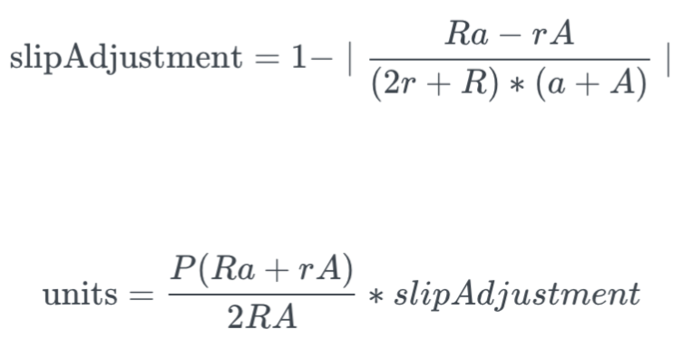

# Liquidity Providers

## Introduction

Liquidity Providers \(LPs\) creating and adding to liquidity pools enables Sifchain to provide swapping functionality. LPs provide assets that can then be swapped for other assets by other users. For example, a LP can come along and say they want to contribute to a Liquidity Pool of Token A &lt;&gt; ROWAN. So they would provide an amount/s of Token A and/or ROWAN to the pool for other people to swap for. 

The LPs are then compensated with swap fees and system rewards. Compensation is affected by a number of factors related to the pool and the state of the network.

Liquidity providers are able to deposit any token Sifchain supports to the appropriate pool. Anyone can create a liquidity pool by pooling ROWAN and a new token into a pool initialization transaction. The price of the new token is set based on the amount of ROWAN pooled. Sifchain enforces a minimum LP size but multiple depositors can contribute to the creation of a single LP.

If users are simply adding to an already existing liquidity pool, they may do so asymmetrically. This means users can add either ROWAN or the token \(TKN\) the pool comprises of. This is as opposed to Uniswap where users must add equal values of the settlement token \(ETH/UNI\) and the other token \(TKN\).  Liquidity providers are able to add or remove liquidity whenever they choose. Please refer to our [Core Concept Documentation on Liquidity Pools ](https://docs.sifchain.finance/core-concepts/liquidity-pool)for additional details around these concepts.

## Why provide liquidity to a pool?

Liquidity pools are important in[ **decentralized finance \(DeFi\)**](https://www.coindesk.com/what-is-defi) ****— particularly decentralized exchanges \(DEX\). Because Sifchain is the world’s first omni-chain DEX, this technology is fundamental to our vision. 

Sifchain enables liquidity providers to add liquidity into pools where they can earn income without constraints endemic to other exchanges. Liquidity providers can deposit any token Sifchain supports to the appropriate pool. They can add liquidity asymmetrically, meaning they can add only Rowan or only TKN for any token.

Sifchain rewards users who provide liquidity with various forms of income. To learn more about what types of income you can expect to earn as a liquidity provider, please reference [here](https://docs.sifchain.finance/core-concepts/liquidity-pool).

## Validator Subsidy Rewards

Sifchain will run a 12-week validatory subsidy program for poolers, in order to incentivize early adopters. Rewards are subject to change based on evaluations of the network from the Sifchain core team, community feedback, and governance over time.

To learn more about this program and what you can expect to earn as part of this program, reference our announcement article [here](https://medium.com/sifchain-finance/uses-for-rowan-the-polyvalent-token-for-omni-chain-decentralized-exchange-dex-3207e7f70f02).

## Liquidity Provider Fees

Liquidity providers will only need to pay gas fees when adding liquidity to a pool. It is important to note, that there is a potential loss of value for a liquidity provider depending on how much slip is created in the pool's price with an asymmetric deposit. This slip calculation can be found [here](https://github.com/Sifchain/sifnode/blob/develop/docs/clp/clp-adr.md). 

## Liquidity Pool Ownership Calculation

Below is the formula used to calculate the units owned by a user when they add Rowan or another asset to the liquidity pool.

## Adding Liquidity

There are a few ways you can add liquidity to a pool:

* 1\) [Sifchain-DEX-UI](https://dex.sifchain.finance): You can use our user-friendly portal to add liquidity to an existing pool, or to create a brand new liquidity pool \(in the case where one does not exist yet\). Please refer to our [Sifchain-DEX-UI Resource](https://docs.sifchain.finance/resources/sifchain-dex-ui#pooling-assets) for clear instructions on how to perform these actions.
* 2\) Manually by running commands. Please refer to the [Liquidity Provider CLI Commands](https://docs.sifchain.finance/roles/liquidity-providers/liquidity-provider-cli-commands) page for additional information. 

## **Removing Liquidity**

When removing liquidity in our asymmetric liquidity pool design, since users are allowed to stake one side or the other, they are also allowed to withdraw one side or the other. Because the system calculates the user’s overall ownership at the time they added liquidity, it can now use that ownership % to calculate the eligible amount\(s\) to withdraw. 

For example:

* Liquidity Pool: ROWAN &lt;&gt; Token A
* A user will identify what percentage of their ownership they want to withdraw. They can select anywhere from 1%-100%.
* Next, the user will specify how much of each token in the pool they want to withdraw. The user can specify any amount between 100% ROWAN to 100% of Token A.

By using these two different values, the system gives LPs a very high level of precision in specifying exactly how much to withdraw from each side of the pool. This differs from other symmetric liquidity pools, where LPs must withdraw equal value from both sides.

When removing liquidity from a pool, LP providers are also subject to swap fees and swap slippage. The reason for this is to prevent users from trying to avoid these price impacts that they would incur from doing a swap instead. This ensures that a user cannot use the adding and removing of liquidity as a means to game the system.

For example:

* If ROWAN price is 0.3USD and a LP deposits 30,000 Rowan, and 300 USDT and then withdraws 100% USDT to get 3,300 USDT and there is no swap, then they’ve essentially just performed a swap without having to pay a swap fee.
* But if the LP deposited 30,000 Rowan and 300 USDT and then withdraws symmetrically \(ie the same as the deposit\), they will receive 3,000 Rowan 300 USDT.

There are a few ways you can remove liquidity to a pool:

* 1\) Sifchain-DEX-UI: You can use our user-friendly portal to remove liquidity at any time. Please refer to our [Sifchain-DEX-UI Resource](https://docs.sifchain.finance/resources/sifchain-dex-ui) for clear instructions on how to perform these actions.
* 2\) Manually by running commands. 
  * Please refer to the [Liquidity Provider CLI Commands](https://docs.sifchain.finance/roles/liquidity-providers/liquidity-provider-cli-commands) page for additional information. 

